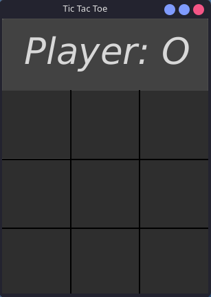
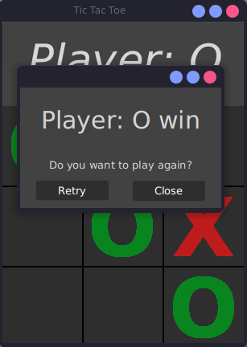

# Tic-Tac-Toe
<p align="center">
  
  
  
</p>

A simple Tic-Tac-Toe game implemented in JavaFx using Maven.

## Screenshots
<div align="center">
  
  
</div>

## Requirements

- Java 16 or higher
- Maven 3.9+

## Building the project

```bash
mvn clean compile
```

## Running the game

```bash
mvn javafx:run
```

## Build JAR archive and run it

```bash
mvn clean package
java -jar target/TicTacToeFX.jar
```

## Testing

Run unit tests:

```bash
mvn test
```

## License

This project is open source and available under the MIT License.

